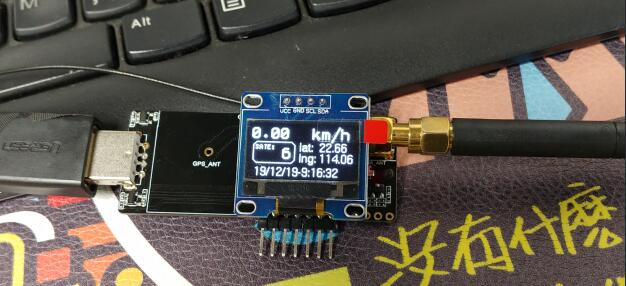
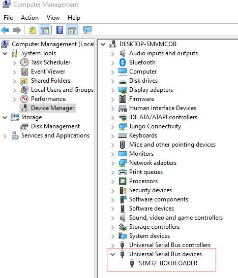

# T-Monitor

# Introduction:

Simple test of LilyGO T-Motion hardware circuit

# Steps:
1. Install [Visual Studio Code](https://code.visualstudio.com/) on your pc, Install PlatformIO in the extension, or you can install [PlatformIO IDE](https://platformio.org/platformio-ide),it's built on top of [Microsoft's Visual Studio Code](https://code.visualstudio.com/)

2. By default, the T-Motion has been programmed with the DFU boot program. You only need to press the Boot key to insert it into the computer to view the STM BOOTLOADER in the device manager, as shown below.

1. The default serial log will use CDC output. If there is no serial output, it may be that the code in the STM32_Core warehouse has not been updated. Please replace **variant/variant.cpp** to **C:\Users\<UserName>\.platformio\packages\framework-arduinoststm32\variants\NUCLEO_L073RZ** , [Thanks to @lyusupov for the RP submission](https://github.com/stm32duino/Arduino_Core_STM32/pull/773) 

2. The program uses **PA4** as the key input pin by default. If you do not connect it, it does not matter, because the default is only used for GPS display, LORA is only to test the transmission of LORA

3. If DFU fails, you can use Jlink or ST-Link to reprogram **frimware/dfu.hex**
Or use Uart for downloading. When using [flasher-stm32](https://www.st.com/en/development-tools/flasher-stm32.html) for programming, you need to hold down the BOOT key and connect to PA9 PA10 for programming.

    ### Wiring diagram
    | USB Bridge | UART Download | T-Monitor |
    | ---------- | ------------- | --------- |
    | RX         | ->            | PA9       |
    | TX         | ->            | PA10      |

    | Jlink/ST-Link | Download | T-Monitor |
    | ------------- | -------- | --------- |
    | SCLK          | ->       | SCLK      |
    | SDIO          | ->       | SDIO      |

    ### Pinout
    | S76/78G           | Pin  |
    | ----------------- | ---- |
    | SX1276/78 rst     | PB10 |
    | SX1276/78 mosi    | PB15 |
    | SX1276/78 miso    | PB14 |
    | SX1276/78 sclk    | PB13 |
    | SX1276/78 cs      | PB12 |
    | SX1276/78 dio0    | PB11 |
    | SX1276/78 dio1    | PC13 |
    | SX1276/78 dio2    | PB9  |
    | SX1276/78 dio3    | PB4  |
    | SX1276/78 dio4    | PB3  |
    | SX1276/78 dio5    | PA15 |
    | Radio switch      | PA1  |
    | Uart Tx           | PA9  |
    | Uart Rx           | PA10 |
    | GPS rst           | PB2  |
    | GPS Rx            | PC11 |
    | GPS Tx            | PC10 |
    | GPS level shifter | PC6  |
    | GPS 1pps          | PB5  |
    | Button            | PA4  |
    | SCL               | PB6  |
    | SDA               | PB7  |

